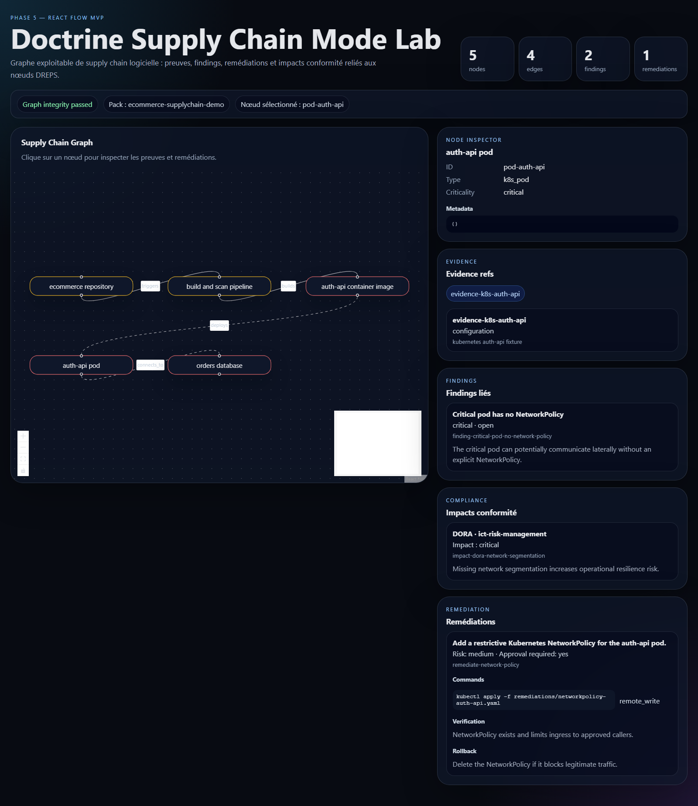

# Doctrine Supply Chain Mode Lab

Clean-room DevSecOps supply chain evidence lab.

## Objectif

Construire progressivement un laboratoire open source capable de modeliser une supply chain logicielle sous forme de preuves, de graphe, de findings, de remediations et d'audit-pack verifiables.

## Phase actuelle

Phase 1 - Initialisation du monorepo.

## Definition of Done

- pnpm install passe.
- pnpm typecheck passe.
- pnpm test passe.
- GitHub Actions passe.

## Commandes

- pnpm install
- pnpm typecheck
- pnpm test
- pnpm supplychain:certify


## UI Demo

The React Flow MVP can be launched locally:

```bash
pnpm dev
```

A demo screenshot is generated by:

```bash
pnpm ux:audit
```




## Reporting Layer

Human-readable reporting views are available through the optional jtable-style layer.

Commands:

- pnpm run report:jtable:findings
- pnpm run report:jtable:compliance
- pnpm run report:jtable:all

Outputs are written to .doctrine/out/reporting/jtable/.

The lab does not require an external jtable binary. A native PowerShell fallback renderer is provided.

## Operator Cookbook

Phase 7 adds command catalogs and runbooks that connect findings to operator actions.

Command:

- pnpm operator:certify

Each demo finding now points to commands, runbooks, verification commands and rollback commands.

## Safe Logger and Command Runner

Phase 8 adds a safe logger and a no-eval command runner.

Command:

- pnpm security:certify

Rules:

- read_only commands can be rendered directly.
- remote_write requires approvalRequired.
- destructive requires approvalRequired and rollback.
- credential_sensitive masks tokens and passwords.
- production_risk requires explicit context.

## Template Engine

Phase 9 adds a small template engine for Markdown reports, PR remediation bodies, Mermaid graphs and Marp summaries.

Commands:

- pnpm template:generate
- pnpm template:certify

Generated outputs are written to .doctrine/out/templates/.

## Markdown / Mermaid / Marp Reporting

Phase 10 adds UI-free reporting outputs for audit review, graph visualization and executive presentation.

Commands:

- pnpm report:markdown:audit
- pnpm report:mermaid:graph
- pnpm report:marp:executive
- pnpm report:readable:certify

Generated outputs:

- .doctrine/out/reports/audit-report.md
- .doctrine/out/diagrams/supplychain.mmd
- .doctrine/out/decks/executive-summary.marp.md

## Artifact Pipeline

Phase 11 adds an artifact pipeline for hashing, zipping and local publication.

Command:

- pnpm artifact:certify

Generated outputs:

- .doctrine/out/audit-pack.sha256.json
- .doctrine/out/audit-pack.zip
- .doctrine/out/artifact-vault/audit-pack.zip

## Local Artifact Vault

Phase 12 adds a local artifact vault for published audit-packs.

Commands:

- pnpm vault:publish
- pnpm vault:certify

Generated index:

- .doctrine/out/local-artifact-vault/index.json
